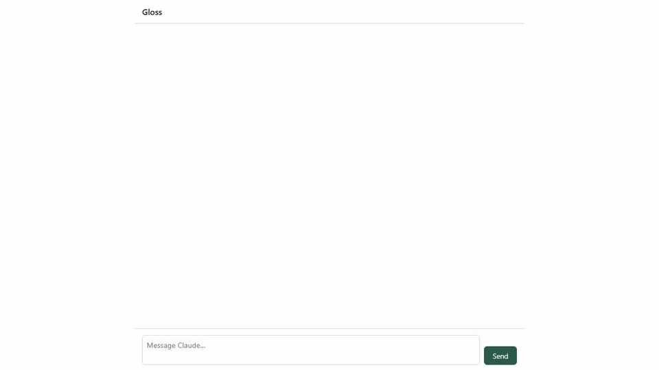

# Gloss

> Gloss any word in your prompt. Claude remembers what it means, forever.

Gloss is a local chat UI for [Claude Code](https://claude.com/claude-code) with
one feature other UIs don't have: **highlight any span of text — in your draft
prompt or in a previous response — and attach context to it.** That context is
saved as a plain markdown "context card" in your project. From then on,
whenever the term (or one of its aliases) appears in a message, the card is
injected into the agent's context automatically — in this session and every
future one — without bloating the prompt you see.

A *gloss* is an explanatory note attached to a specific word in a text. That's
the whole product.



*Recorded in Gloss's offline demo mode (`GLOSS_FAKE_AGENT=1`), so the
assistant's replies are scripted — but the highlighting, the card, the matching
and the injection you see are the real code paths.*

## The problem

When you prompt a coding agent, context for a specific term either gets
crammed into one giant paragraph, or it gets lost when the session ends. You
type "I want a dashboard that helps me build xyz" — and then explain what
`xyz` is. Again. Every session.

With Gloss: highlight `xyz`, type two paragraphs about it once, and save. Your
prompt stays one sentence. The agent gets the full context. Next week's
session still knows what `xyz` means.

## How it works

1. **Select** a span in the draft input or any message → a small affordance
   appears → click it to open the card panel.
2. **Save** — the card is written to `.gloss/cards/<slug>.md` in your project:
   YAML frontmatter (`term`, `aliases`, timestamps, provenance) + a markdown
   body. Human-editable, git-committable, no database.
3. **Match** — every user message is matched against your terms and aliases
   (exact, case-insensitive, light stemming, word-boundary aware — `xyz`
   never fires inside `xyzabc` or `my_xyz_v2`).
4. **Inject** — matched cards are packed under a token budget
   (most-recently-updated wins) and injected into the agent's context via the
   Claude Agent SDK's `UserPromptSubmit` hook. A chip on your message shows
   exactly which cards were injected — nothing happens silently.

A card, in full:

```markdown
---
term: xyz
aliases:
  - metrics panel
created: 2026-07-13T20:15:00Z
updated: 2026-07-13T20:15:00Z
scope: project
source:
  span: "xyz"
  message: "I want a dashboard that helps me build xyz"
---

xyz is our internal name for the customer-facing metrics panel. It reads from
the `analytics_rollup` table, must stay under 200ms p95, and is owned by the
growth team. Do not add new queries without an index review.
```

## Quick start

Prerequisites: Node ≥ 20, pnpm (`corepack enable`), an `ANTHROPIC_API_KEY`.

```bash
git clone https://github.com/PhilipN27/prompt-gloss.git
cd prompt-gloss
pnpm install
GLOSS_PROJECT_DIR=/path/to/your/project pnpm dev
```

Open the printed localhost URL, type a prompt, highlight a word, and gloss it.
Cards land in `.gloss/cards/` inside your project.

To try it without an API key, run with `GLOSS_FAKE_AGENT=1` — scripted
replies, real everything-else.

## An honest comparison

**Gloss is not a general-purpose Claude Code web UI.** If you want tabs, a
file browser, git integration, and a plugin system, use
[CloudCLI](https://cloudcli.ai) (~11k stars) or
[cui](https://github.com/wbopan/cui) — they are good at that, and Gloss
deliberately isn't one. Gloss exists because no UI, CloudCLI's plugin API
included, lets anything hook into the chat pane's selection and injection
path — so the span-anchored interaction needed its own thin app
(the full evidence is in [ARCHITECTURE.md](ARCHITECTURE.md)).

**Gloss is not a generic memory layer.** [mem0](https://mem0.ai),
[supermemory](https://supermemory.ai), and MCP memory servers store and
retrieve facts globally, usually deciding for themselves what to remember.
Gloss does one narrower thing: context anchored to a **specific span you
highlighted**, injected only when that term appears, always visible in an
indicator, stored as files you can read and edit. If you want automatic
whole-conversation memory, use those tools. If you want "this word means this,
exactly, everywhere, forever" — that's Gloss.

| | Gloss | mem0 / supermemory | CloudCLI / cui |
|---|---|---|---|
| Span-anchored context | **yes — the product** | no | no |
| What gets remembered | what you highlight and write | what the system extracts | n/a |
| Storage | markdown files in your repo | hosted / vector DB | n/a |
| Injection visibility | per-message indicator | opaque | n/a |
| General chat UI features | no (by design) | n/a | yes |

## Privacy

Cards can contain sensitive project context. They are **never** transmitted
anywhere except into your local agent session: the server binds to
`127.0.0.1`, there is no telemetry, no cloud sync, no accounts. Whether you
commit `.gloss/` or add it to `.gitignore` is your call — note that each
card's `source.message` frontmatter stores a short excerpt of the prompt it
was created from, so committing cards puts those excerpts in git history.
Machine-local state under `.gloss/.state/` self-gitignores.

## Development

pnpm workspace monorepo: `packages/core` (store, matcher, injection budget —
pure Node), `packages/server` (Fastify + Claude Agent SDK), `packages/web`
(React UI). TypeScript strict, TDD for the core, a matcher golden set as a CI
merge gate, Playwright for the interaction.

```bash
pnpm check      # lint + typecheck + unit + matcher eval
pnpm test:e2e   # 7 Playwright scenarios, hermetic, no API key needed
```

Start with [CLAUDE.md](CLAUDE.md) / [AGENTS.md](AGENTS.md), then
[ARCHITECTURE.md](ARCHITECTURE.md), [ROADMAP.md](ROADMAP.md) (what v2 is and
what Gloss will never be), and [TESTING.md](TESTING.md).

## License

[MIT](LICENSE) © Philip Nora
